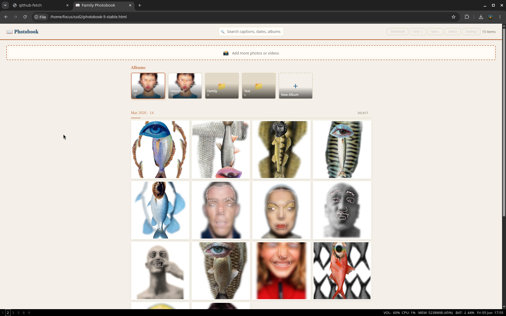

# photobook

> A private, offline-first photo and video organiser that runs entirely in your browser. Your files never leave your device.



---

## What it does

photobook gives your local photo collection the feel of a proper app: albums, captions, search, slideshow — without uploading anything anywhere. It reads directly from a folder on your drive using the browser's [File System Access API](https://developer.mozilla.org/en-US/docs/Web/API/File_System_Access_API) and stores metadata in a hidden `.photobook.json` file alongside your photos.

---

## Features

- **Albums** — create and rename albums, assign photos to multiple albums at once
- **Captions & dates** — add captions per photo; dates parsed from file metadata
- **Search** — live search across filenames and captions
- **Grid sizes** — small / medium / large thumbnail sizes
- **Slideshow** — configurable interval (2–20 s), keyboard navigable
- **Fullscreen projector mode** — one click to fill the screen
- **Video support** — plays MP4, MOV, M4V, WebM; generates poster-frame thumbnails automatically
- **HEIC / HEIF support** — converts iPhone photos on the fly via a three-pass fallback (heic2any → libheif WASM → `createImageBitmap`), including iPhone 15 HDR gain-map HEICs
- **Auto-sync** — detects files added or removed from the folder since last open
- **Session persistence** — remembers your folder across page reloads (no re-picking required)
- **Offline-first** — no server, no account, no cloud

---

## Getting started

### Requirements

- **Chrome, Edge, or Opera** (desktop) — the File System Access API is required
- Firefox and Safari are not currently supported (they lack `showDirectoryPicker`)

### Setup

```
your-photos/
├── photos/      ← put your images and videos here or open the app and drag them onto the upload field
└── photobook-5-stable.html   ← open this
└── appData/
    ├── styles.css
    ├── heic2any.js
    ├── heic-decode.browser.js
```

1. Create a folder anywhere on your drive
2. Open `photobook-5-stable.html` in Chrome or Edge
3. Click **Open Photobook Folder** and select your top-level folder
4. photobook syncs your files and you're in

On subsequent visits, the app reopens your folder automatically (one permission click to re-grant access).

---

## Supported formats

| Type | Formats |
|------|---------|
| Images | JPEG, PNG, WebP |
| HEIC / HEIF | `.heic`, `.heif` (converted to JPEG on import) |
| Video | MP4, MOV, M4V, WebM |

Images over 4096 px on either side are resampled on import. JPEG quality is 0.95.

---

## How metadata is stored

Everything is saved in a hidden `.photobook.json` file inside your folder. It stores album assignments, captions, and dates — **not** the photos themselves. Delete the file to reset to a clean state.

The file is dot-prefixed so it's invisible in Finder and most Linux file managers. It will be visible in Windows Explorer (the File System Access API cannot set OS-level hidden flags).

---

## Keyboard shortcuts

| Key | Action |
|-----|--------|
| `←` / `→` | Previous / next photo in viewer |
| `Escape` | Close viewer or exit slideshow |
| `F` | Toggle fullscreen |

---

## Browser support

| Browser | Status |
|---------|--------|
| Chrome 86+ | ✅ Fully supported |
| Edge 86+ | ✅ Fully supported |
| Opera 72+ | ✅ Fully supported |
| Firefox | ❌ No `showDirectoryPicker` support |
| Safari | ❌ No `showDirectoryPicker` support |

---

## Privacy

Nothing is uploaded. The app has no network requests, no analytics, no cookies. All processing happens locally in your browser tab.

---

## License

MIT
